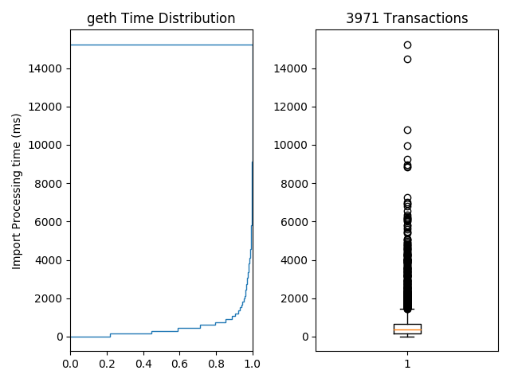
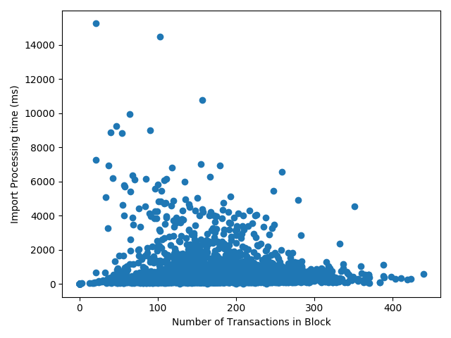
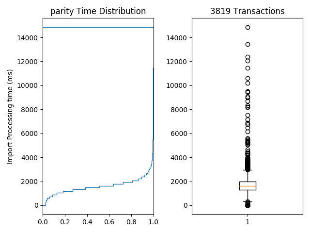
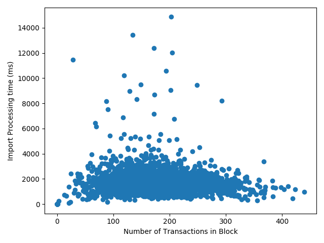

# Current Import Times for Ethereum Nodes

These numbers are based on roughly 4000 blocks for archive nodes running on the same machene.

### Geth

```
[+] Processed 3971 blocks (in range 10534273 - 10538014)
[+] Averages:
[++] Average Txs: 171.07
[++] Average Mgas: 12.09
[++] Average ms: 608.61
[++] Average (weighted) mgasps: 12.42
[+] Extremes:
[++] Shortest time: 2.95
[++] Longest time: 15238.00
[+] Percentiles:
[++]  5th Percentiles: 87.87
[++] 25th Percentiles: 173.54
[++] 50th Percentiles: 358.32
[++] 75th Percentiles: 680.80
[++] 90th Percentiles: 1169.00
[++] 95th Percentiles: 1947.50
[++] 99th Percentiles: 4661.60
```

#### Distribution Plot




#### Scatter Plot
There appears to be no obvious colleration betweens number of transactions and import time.




### Parity/OpenEthereum

```
[+] Processed 3819 blocks (in range 10533521 - 10538020)
[+] Averages:
[++] Average Txs: 177.83
[++] Average Mgas: 12.11
[++] Average ms: 1697.91
[++] Average (weighted) mgasps: 12.42
[+] Extremes:
[++] Shortest time: 0.00
[++] Longest time: 14864.00
[+] Percentiles:
[++]  5th Percentiles: 680.90
[++] 25th Percentiles: 1306.00
[++] 50th Percentiles: 1622.00
[++] 75th Percentiles: 1971.50
[++] 90th Percentiles: 2410.20
[++] 95th Percentiles: 2845.00
[++] 99th Percentiles: 4324.10
```
#### Distribution Plot




#### Scatter Plot
There appears to be no obvious colleration betweens number of transactions and import time.




## Script for generation

[importtime.py](importtime.py)
